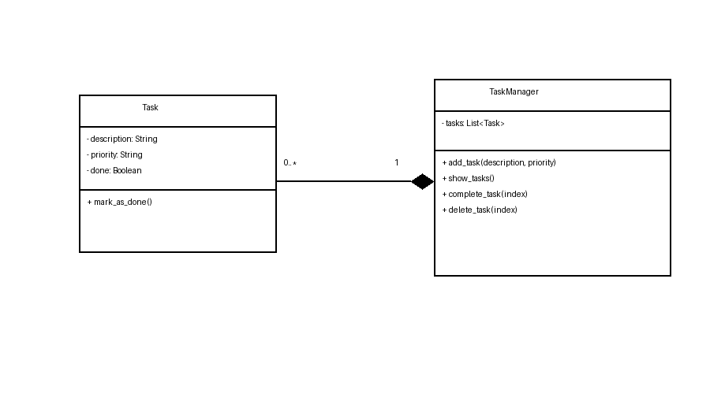

# PrioryTask

PrioryTask is a simple task manager developed in Python that allows users to create and organize tasks using priority levels.

This project was created as part of the Final Project (Sprint 1 & Sprint 2).

---

## Features

- Create tasks
- Assign priority levels
- View registered tasks
- Simple console interface
- Object-oriented design

---

## Project Structure

```
tp_final/
│
├── main.py                     # Application entry point
├── task.py                     # Task class
├── task_manager.py             # Task management logic
├── README.md
├── uml_priorytask_tp_final.png # UML Diagram
├── TP Final Sprint 1 Documentación.pdf
└── TP Final Sprint 2 Documentación.pdf
```

---

## UML Diagram

This diagram represents the structure of the system and the relationship between classes.



---

## How to Run

### Requirements

- Python 3.10+

### Execute

```bash
python main.py
```

---

## Architecture

The application follows an object-oriented approach:

- **Task**
  - Stores task information
  - Includes task attributes and behavior

- **TaskManager**
  - Handles task operations
  - Stores and manages multiple tasks

- **main**
  - Entry point
  - Controls user interaction

---

## Documentation

Included in the repository:

- TP Final Sprint 1 Documentation
- TP Final Sprint 2 Documentation
- UML Diagram

---

## Authors

Developed by:

- Axel Flores