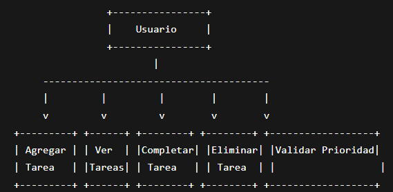

# PrioryTask


PrioryTask is a task manager application developed in Python using an object-oriented programming approach.

The project was created as part of the Final QA Project and includes automated testing using pytest.

---

## Features

- Create tasks
- Assign priority levels
- Complete tasks
- Delete tasks
- View registered tasks
- Input validation
- Automated testing with pytest
- Console-based interaction

---

## Technologies Used

- Python 3
- Pytest
- Git & GitHub
- Visual Studio Code

---

## Project Structure

```bash
tp_final/
│
├── main.py
├── task.py
├── task_manager.py
│
├── tests/
│   ├── test_task.py
│   └── test_task_manager.py
│
├── uml_priorytask_tp_final.png
├── use_case_diagram.png
├── README.md
├── TP Final Sprint 1 Documentación.pdf
├── TP Final Sprint 2 Documentación.pdf
├── TP Final Sprint 3 Documentación.pdf
└── TP Final Sprint 4 Documentación.pdf
```

---

## UML Diagram

This UML diagram represents the structure and relationships between the classes used in the project.


## Use Case Diagram




---


## How to Run the Application

### Requirements

- Python 3.10 or higher

### Execute the application

```bash
python main.py
```

---

## Automated Testing

The project includes automated tests implemented with pytest.

### Install pytest

```bash
python -m pip install pytest
```

### Run tests

```bash
pytest
```

### Executed Test Cases

- Task creation
- Add task validation
- Invalid priority validation
- Complete task functionality
- Delete task functionality
- Multiple task operations

### Test Result

```bash
8 passed in 0.07s
```

---

## End-to-End Testing (E2E)

The project includes End-to-End tests designed to validate complete user workflows.

### E2E Scenarios

#### E2E-01 Complete Task Lifecycle

1. Create a task
2. View tasks
3. Complete the task
4. View tasks again
5. Delete the task
6. Verify it no longer appears

#### E2E-02 Invalid Input Handling

1. Attempt to create a task with an invalid priority
2. Verify error message
3. Confirm the application continues running

### Result

All E2E scenarios were executed successfully.

---

## Architecture

### Task Class

Represents a task and stores:

- Description
- Priority
- Completion status

### TaskManager Class

Responsible for:

- Adding tasks
- Completing tasks
- Deleting tasks
- Managing task storage
- Validating priorities

### Main Module

Handles user interaction through the console interface.

---

## Sprint Progress

### Sprint 1
- Project initialization
- UML design
- Base architecture

### Sprint 2
- Core functionality implementation
- Test case definition

### Sprint 3
- Automated testing implementation
- Pytest integration
- Execution of defined test cases

### Sprint 4
- End-to-End (E2E) testing
- Execution of complete user workflows
- Validation of system behavior from the user perspective

---

## Documentation

Included in the repository:

- Sprint 1 Documentation
- Sprint 2 Documentation
- Sprint 3 Documentation
- Sprint 4 Documentation
- UML Diagram
- UML Use Case Diagram

---

## Author

Developed by:

- Axel Flores